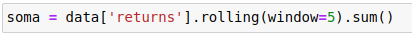
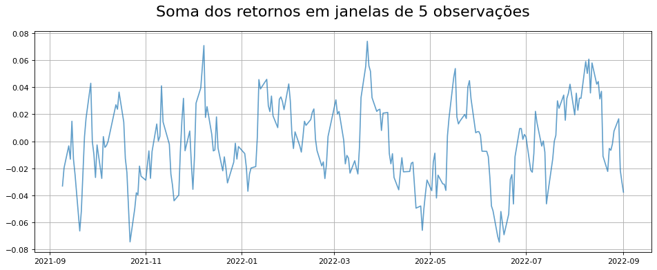
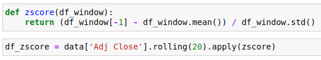
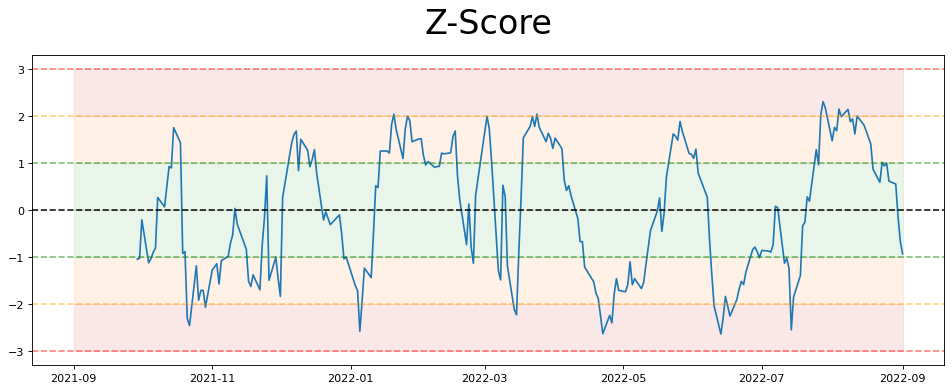
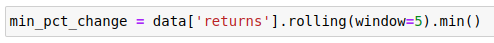
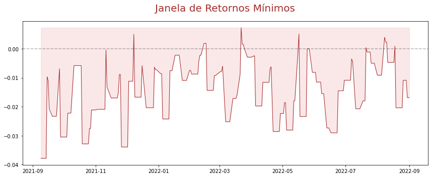

# Utilizando o _rolling_ do Pandas

O _rolling_ é uma função muito interessante porque ela realiza cálculos em blocos de dados.

Desenvolvemos 3 exemplos para demonstrar a utilização da função: soma, z-score e retornos mínimos.

## Soma

## Z-Score

## Retornos Mínimos

